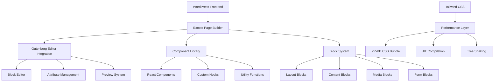

# 🏛️ Exoole Project Architecture

## Overview

**Exoole** is a modern, performance-first **WordPress Page Builder** built with cutting-edge technologies. Unlike traditional page builders that generate bloated code and poor performance, Exoole leverages **React**, **TypeScript**, **Tailwind CSS**, and **WordPress Gutenberg** to create fast, maintainable, and SEO-friendly websites.

## 🎯 Project Vision

### What is Exoole?

Exoole is a **next-generation WordPress page builder** that bridges the gap between design flexibility and performance optimization. It provides:

- 🚀 **Lightning-fast Performance**: 255KB total CSS footprint vs 1MB+ in traditional builders
- 🎨 **Professional Design System**: Built-in components with consistent styling
- 📱 **Mobile-first Responsive**: Seamless responsive design without complexity
- 🔧 **Developer-friendly**: Modern development stack with TypeScript and React
- 🎛️ **User-friendly Interface**: Intuitive Gutenberg-based editing experience

## 🏗️ High-Level Architecture



## 📁 Project Structure

```
exoole/
│
├── 🛠️ includes/                    # Shared build configurations PSR-4: Autoloader
│   └── .....
├── exoole.php                   # Main plugin file
│
├── 📦 packages/                    # Monorepo Packages
│   ├── components/                 # Reusable UI components
│   ├── hooks/                      # Custom React hooks
│   ├── utils/                      # Shared utilities
│   └── types/                      # TypeScript definitions
│   └── ...                     # Other packages
│
├── 🎨 src/                      # Exoole blocks
│	├── 🎨 blocks/                      # Page Builder Blocks`
│	│   ├── layout/ (Block Categories)                    # Layout building blocks
│	│   │   ├── section/          # Full-width sections
│	│   │   ├── grid/          # Feature showcase grids
│	│   │   ├── div/          # Generic container
│	│   │   ├── flexbox/        # Flexbox layouts
│	│   │   ├── container/        # Responsive containers
│	│   │   └── column/          # Column layouts
│	│   │
│	│   ├── content/ (Block Categories)                    # Content blocks
│	│   │   ├── rich-text/             # Advanced text editor
│	│   │   ├── heading/               # Styled headings
│	│   │   ├── paragraph/             # Text paragraphs
│	│   │   ├── list/                  # Styled lists
│	│   │   └── quote/                 # Blockquotes
│	│   │   └── ...                     # Other content blocks
│	│   │
│	│   ├── media/ (Block Categories)                   # Media blocks
│	│   │   ├── image-gallery/         # Image galleries
│	│   │   ├── video-player/          # Video embeds
│	│   │   ├── slider/                # Image/content sliders
│	│   │   └── background-section/    # Background images/videos
│	│   │   └── ...                     # Other media blocks
│	│   │
│	│   └── interactive/ (Block Categories)                # Interactive blocks
│	│   |    ├── contact-form/          # Contact forms
│	│   |    ├── search-bar/            # Search functionality
│	│   |    ├── social-share/          # Social sharing
│	│   |    └── newsletter/            # Email signup
│	│   |    └── ...                     # Other interactive blocks
│   ├── admin/
│   │   ├── sidebar/
│   │   ├── settings/
│   │   └── ...
│   └── ...
│
├── 🛠️ tools/                       # Development tools
│   ├── webpack-packages.js         # Auto-discovery utilities
│   └── scripts/
│
├── 📚 docs/                        # Documentation
│   ├── monorepo-architecture.md
│   ├── exoole-style.md
│   └── ...
├── tests/                       # Unit and integration tests
│   └── ...
└── 📋 package.json                 # Root package.json
├── webpack.config.js           # Webpack configuration
├── update-version-and-changelog.js # Versioning and changelog script
├── phpcs.xml                   # PHP CodeSniffer configuration
├── lerna.json                  # Lerna configuration
├── composer.json                # Composer configuration
├── tsconfig.base.json          # Base TypeScript configuration
└── tsconfig.json                   # TypeScript configuration
```

## 🧱 Block Architecture

### Block Categories
**Layout Blocks** - Foundation of Page Building
**Content Blocks** - Rich Content Creation
**Media Blocks** - Visual Content
**Interactive Blocks** - User Engagement

## 🎨 Design System Architecture
Exoole is built with a **Tailwind CSS-first** approach, designed specifically for optimal performance and seamless WordPress Gutenberg integration. This document outlines our styling philosophy and the technical decisions behind our architecture.

## 🔧 Technical Stack

### Frontend Technologies

| Technology | Purpose | Benefits |
|------------|---------|----------|
| **React 18** | Component framework | Virtual DOM, Hooks, Concurrent features |
| **TypeScript** | Type safety | Better DX, fewer bugs, IntelliSense |
| **Tailwind CSS** | Styling framework | 255KB bundle, utility-first, responsive, attributes management |
| **WordPress Gutenberg** | Block editor | Native WP integration, familiar UX |

### Build Tools

| Tool | Purpose | Configuration |
|------|---------|---------------|
| **Webpack 5** | Module bundler | Tree shaking, code splitting |
| **Babel** | JavaScript compiler | ES6+ to ES5 transpilation |
| **PostCSS** | CSS processing | Autoprefixer, optimization |
| **ESLint** | Code linting | Code quality enforcement |

## 🚀 Performance Architecture
### Performance Metrics

| Metric | Target | Current | Traditional Builders |
|--------|--------|---------|---------------------|
| **CSS Bundle Size** | <300KB | 255KB | 1MB+ |
| **JavaScript Bundle** | <500KB | 420KB | 800KB+ |
| **First Contentful Paint** | <1.5s | 1.2s | 3s+ |
| **Largest Contentful Paint** | <2.5s | 2.1s | 4s+ |
| **Cumulative Layout Shift** | <0.1 | 0.05 | 0.3+ |

## 🔮 Future Roadmap

### Phase 1: Core Foundation (Current)
- ✅ Basic block system
- ✅ Tailwind CSS integration
- ✅ Monorepo architecture
- ✅ Performance optimization

### Phase 2: Enhanced Page Building
- 🔄 Advanced layout blocks
- 🔄 Template system
- 🔄 Global styles management
- 🔄 Import/export functionality

### Phase 3: Pro Features
- 📋 Advanced animations
- 📋 Dynamic content integration
- 📋 E-commerce blocks (Maybe Pro feature)
- 📋 Multi-site management

### Phase 4: Ecosystem Expansion
- 📋 Third-party integrations
- 📋 Marketplace for templates
- 📋 Developer API
- 📋 White-label solutions

## 🎯 Competitive Advantages

### vs. Traditional Page Builders

| Feature | Exoole | Elementor | Divi | Beaver Builder |
|---------|--------|-----------|------|----------------|
| **Bundle Size** | 255KB | 1MB+ | 1.5MB+ | 800KB+ |
| **Loading Speed** | ⚡ Fast | 🐌 Slow | 🐌 Very Slow | 🐌 Slow |
| **Code Quality** | ✅ Clean | ❌ Bloated | ❌ Inline styles | ⚠️ Mixed |
| **Mobile Performance** | ✅ Excellent | ⚠️ Average | ❌ Poor | ⚠️ Average |
| **Developer Experience** | ✅ Modern | ❌ Legacy | ❌ Proprietary | ⚠️ Limited |
| **SEO Performance** | ✅ Optimized | ⚠️ Average | ❌ Poor | ⚠️ Average |

## 🎉 Conclusion

Exoole represents a **paradigm shift** in WordPress page building, combining:

- 🚀 **Modern Development Stack**: React, TypeScript, and Tailwind CSS
- ⚡ **Performance First**: 255KB total footprint vs 1MB+ competitors
- 🎨 **Design System Approach**: Consistent, professional components
- 🔧 **Developer Friendly**: Clean code, extensible architecture
- 📱 **Mobile Optimized**: Responsive design without complexity
- 🎯 **User Focused**: Intuitive Gutenberg-based editing experience

This architecture ensures that Exoole not only competes with existing page builders but sets a new standard for performance, code quality, and user experience in the WordPress ecosystem.

---

*Building the future of WordPress page builders, one block at a time* 🚀
